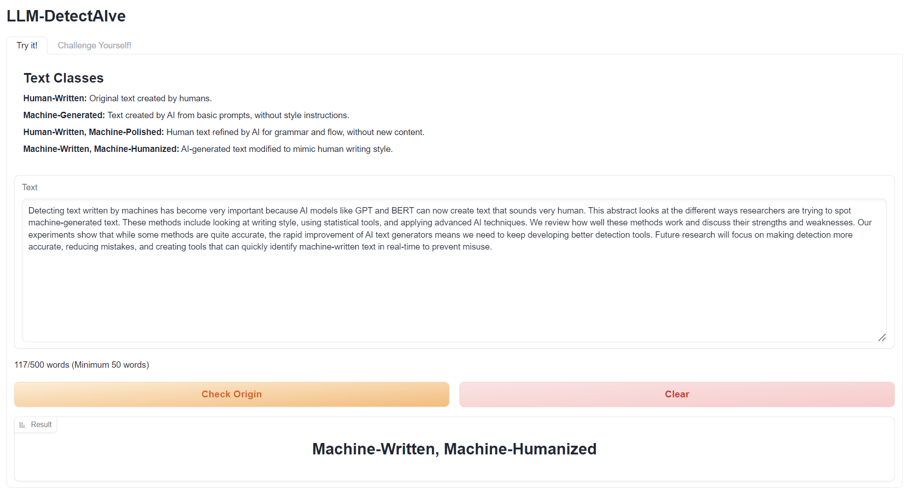
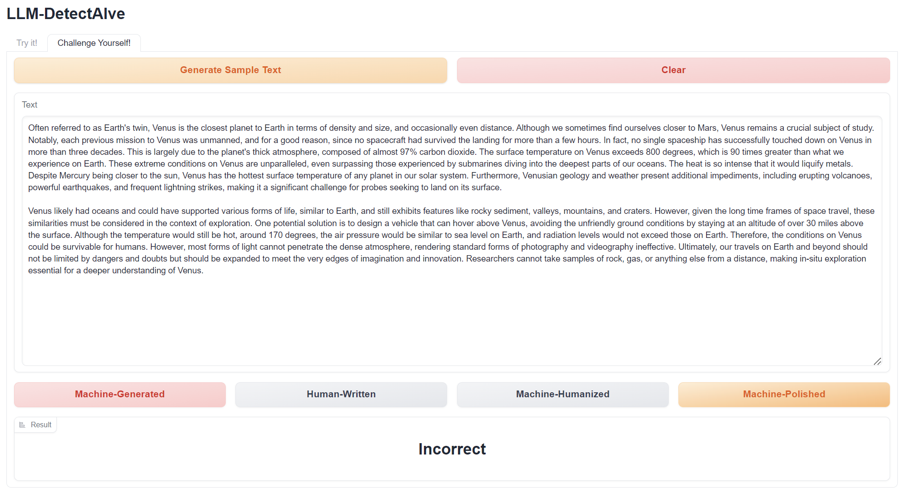
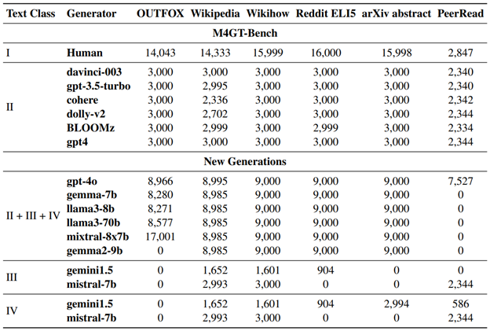

# LLM-DetectAIve

*A Tool for Fine-Grained Machine-Generated Text Detection*

<a href="https://arxiv.org/abs/2405.05583"></a>

<a href="https://huggingface.co/spaces/raj-tomar001/LLM-DetectAIve">
  
</a>

[Try it yourself!](tps://huggingface.co/spaces/raj-tomar001/LLM-DetectAIve)

[Video demo](https://www.youtube.com/watch?v=E8eT_bE7k8c&feature=youtu.be)


---

## Overview  

LLM-DetectAIve is a system designed for fine-grained MGT detection. It is aims to classify texts from a variety of topics into four categories: human-written, machine-generated, machine-written machine-humanized, and human-written machine-polished.

LLM-DetectAIve can effectively identify the authorship of textual content, proving its usefulness in enhancing integrity in education, academia, and other domains. LLM-DetectAIve is publicly accessible on hugging face

---

## Demo Interface

The demonstration for LLM-DetectAIve has two tabs

### 1. Automatic Text Detection


    
Lets the user input any text (> 50 words) to get a prediction from LLM-DetectAIve.


### 2. Human Detector Playground



Lets the user see if they can correctly label data given a random sample text.

## Data Generated

Across LLMs over the four classes:  
I. Human-Written  
II. Machine-Generated  
III. Machine-Written Machine-Humanized  
IV. Human-Written Machine-Polished  
 



<!--  -->
For row II + III + IV, the data is approximately uniformly distributed across the three classes.


---

## Evalution

To be filled out

## Installation  
To be filled out

```bash
git clone https://github.com/username/LLM-DetectAIve.git  

```

## Cite
If you use LLM-DetectAIve in your research cite as:
```bibtex

```
